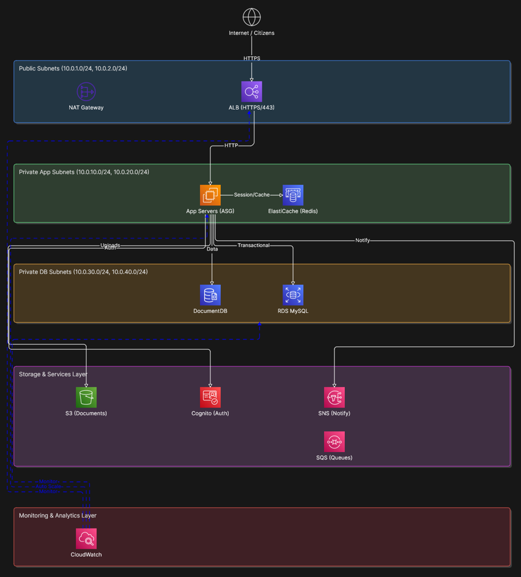

# Sistem Layanan Publik dan Pelaporan Warga

## Informasi Peserta

- **Nama:** Arfan
- **Kode Peserta:** 284A63A0

## Deskripsi Proyek

Aplikasi web berbasis Laravel untuk menyediakan layanan publik dan sistem pelaporan masalah lingkungan warga. Sistem ini memungkinkan warga untuk mengajukan permintaan layanan administrasi, melaporkan masalah di lingkungan mereka, dan menerima notifikasi real-time regarding status permintaan. Admin dapat mengelola permintaan layanan, melihat semua laporan, dan mengakses dashboard statistik.

## Diagram Arsitektur



### Arsitektur AWS

Sistem ini dideploy menggunakan arsitektur AWS yang meliputi:

- **ALB (Application Load Balancer):** Menangani traffic HTTPS dari internet
- **App Servers (ASG):** Auto Scaling Group untuk aplikasi Laravel dengan nginx dan php-fpm
- **ElastiCache (Redis):** Untuk session, cache, dan queue
- **DocumentDB:** Database MongoDB untuk menyimpan data aplikasi
- **RDS MySQL:** Database relasional untuk data transaksional
- **S3:** Penyimpanan dokumen dan file upload
- **Cognito:** Autentikasi pengguna
- **SNS:** Notifikasi real-time
- **SQS:** Queue untuk proses asynchronous
- **CloudWatch:** Monitoring dan analytics

## Teknologi yang Digunakan

### Backend
- **Laravel 10.x** - Framework PHP
- **PHP 8.2** - Bahasa pemrograman
- **MySQL 8.0** - Database relasional
- **Redis 7** - Cache, session, dan queue
- **JWT (JSON Web Token)** - Autentikasi API

### Infrastructure & Deployment
- **Docker & Docker Compose** - Containerization
- **Nginx** - Web server
- **AWS EC2** - Application servers
- **AWS RDS** - Managed MySQL database
- **AWS ElastiCache** - Managed Redis
- **AWS DocumentDB** - Managed MongoDB
- **AWS S3** - Object storage
- **AWS Cognito** - User authentication
- **AWS SNS & SQS** - Notifikasi dan messaging
- **Terraform** - Infrastructure as Code

### Development Tools
- **Composer** - PHP dependency manager
- **Supervisor** - Process manager untuk queue worker

## Cara Menjalankan Secara Lokal dengan Docker Compose

### Prerequisites

Pastikan Anda telah menginstall:
- Docker Engine 20.10+
- Docker Compose 2.0+
- Git

### Langkah-langkah

#### 1. Clone Repository

```bash
git clone https://github.com/Arfan9swn/lks-kaltim-2026-ARF-284A63A0.git
cd lks-kaltim-2026-ARF-284A63A0
```

#### 2. Setup Environment

```bash
# Copy file environment
cp .env.example .env

# Generate APP_KEY
docker-compose run --rm app php artisan key:generate

# Generate JWT Secret
docker-compose run --rm app php artisan jwt:secret
```

#### 3. Build dan Start Services

```bash
# Build Docker images
docker-compose build

# Start semua services (app, mysql, redis)
docker-compose up -d

# Cek status services
docker-compose ps

# Lihat logs
docker-compose logs -f
```

#### 4. Setup Database

```bash
# Jalankan migrations
docker-compose exec app php artisan migrate

# (Opsional) Jalankan database seeder
docker-compose exec app php artisan db:seed
```

#### 5. Akses Aplikasi

- **API:** http://localhost:8000
- **MySQL:** localhost:3306
  - Username: `laravel`
  - Password: `laravel`
- **Redis:** localhost:6379
  - Password: sesuai dengan `REDIS_PASSWORD` di file `.env`

### Perintah Docker yang Berguna

#### Build dan Start

```bash
# Build images
docker-compose build

# Start services
docker-compose up -d

# Stop services
docker-compose down

# Stop dan hapus volumes (PERINGATAN: menghapus semua data)
docker-compose down -v
```

#### Application Commands

```bash
# Jalankan artisan commands
docker-compose exec app php artisan <command>

# Contoh:
docker-compose exec app php artisan migrate
docker-compose exec app php artisan db:seed
docker-compose exec app php artisan route:list
docker-compose exec app php artisan config:clear
docker-compose exec app php artisan cache:clear
```

#### Melihat Logs

```bash
# Semua services
docker-compose logs -f

# Service tertentu
docker-compose logs -f app
docker-compose logs -f mysql
docker-compose logs -f redis
```

#### Shell Access

```bash
# Masuk ke container app
docker-compose exec app sh

# Masuk ke MySQL
docker-compose exec mysql mysql -u laravel -p laravel

# Masuk ke Redis
docker-compose exec redis redis-cli -a your_redis_password_here
```

#### Troubleshooting

```bash
# Fix permission issues
docker-compose exec app chown -R laravel:laravel storage bootstrap/cache

# Clear semua cache
docker-compose exec app php artisan config:clear
docker-compose exec app php artisan cache:clear
docker-compose exec app php artisan route:clear
docker-compose exec app php artisan view:clear

# Rebuild setelah perubahan kode
docker-compose down
docker-compose build --no-cache
docker-compose up -d
```

## Ringkasan Endpoint API

Base URL: `http://localhost:8000/api/v1`

### Autentikasi

| Method | Endpoint | Deskripsi | Auth |
|--------|----------|-----------|------|
| POST | `/auth/register` | Registrasi user baru | No |
| POST | `/auth/login` | Login dan dapatkan token JWT | No |
| POST | `/auth/logout` | Logout dan batalkan token | Yes |
| GET | `/auth/profile` | Lihat profil user terautentikasi | Yes |
| POST | `/auth/refresh` | Refresh token JWT | Yes |

### Layanan Public

| Method | Endpoint | Deskripsi | Auth |
|--------|----------|-----------|------|
| GET | `/services` | Daftar semua jenis layanan | No |
| POST | `/services/request` | Ajukan permintaan layanan | Yes |
| GET | `/services/request/{id}` | Lihat detail permintaan layanan | Yes |
| PUT | `/services/request/{id}/status` | Update status permintaan (Admin) | Yes (Admin) |
| GET | `/services/requests` | Daftar semua permintaan (Admin) | Yes (Admin) |

### Laporan Warga

| Method | Endpoint | Deskripsi | Auth |
|--------|----------|-----------|------|
| POST | `/reports` | Kirim laporan masalah | Yes |
| GET | `/reports` | Daftar laporan | Yes |
| GET | `/reports/{id}` | Detail laporan | Yes |
| PUT | `/reports/{id}` | Update laporan | Yes |

### Notifikasi

| Method | Endpoint | Deskripsi | Auth |
|--------|----------|-----------|------|
| GET | `/notifications` | Daftar notifikasi | Yes |
| PUT | `/notifications/{id}/read` | Tandai notifikasi sebagai dibaca | Yes |
| PUT | `/notifications/read-all` | Tandai semua notifikasi sebagai dibaca | Yes |

### Dashboard (Admin Only)

| Method | Endpoint | Deskripsi | Auth |
|--------|----------|-----------|------|
| GET | `/dashboard/stats` | Statistik ringkasan dashboard | Yes (Admin) |
| GET | `/dashboard/reports/summary` | Rekapitulasi laporan per kategori | Yes (Admin) |

### Autentikasi API

Semua endpoint kecuali register, login, dan daftar layanan memerlukan autentikasi token JWT. Sertakan token dalam header:

```
Authorization: Bearer {your_token}
```

Dokumentasi API lengkap dapat dilihat di [docs/api-documentation.md](docs/api-documentation.md)

## Variabel Environment yang Dibutuhkan

File `.env` harus berisi variabel berikut:

```env
# Application
APP_NAME=Laravel
APP_ENV=production
APP_KEY=
APP_DEBUG=false
APP_URL=http://localhost:8000

# Logging
LOG_CHANNEL=stack
LOG_LEVEL=debug

# Database (MySQL)
DB_CONNECTION=mysql
DB_HOST=mysql
DB_PORT=3306
DB_DATABASE=laravel
DB_USERNAME=laravel
DB_PASSWORD=laravel
DB_ROOT_PASSWORD=root

# Redis
REDIS_PASSWORD=your_redis_password_here

# JWT Authentication
JWT_SECRET=your_jwt_secret_key_here

# Cache & Queue
CACHE_DRIVER=redis
QUEUE_CONNECTION=redis
SESSION_DRIVER=redis
SESSION_LIFETIME=120
```

### Penjelasan Variabel

- **APP_KEY:** Kunci enkripsi Laravel (generate dengan `php artisan key:generate`)
- **APP_DEBUG:** Set ke `false` untuk production, `true` untuk development
- **DB_*:** Konfigurasi database MySQL
- **REDIS_PASSWORD:** Password untuk Redis server
- **JWT_SECRET:** Kunci rahasia untuk JWT authentication (generate dengan `php artisan jwt:secret`)
- **CACHE_DRIVER, QUEUE_CONNECTION, SESSION_DRIVER:** Menggunakan Redis untuk performa optimal

## Port yang Digunakan

- **8000:** Application (HTTP)
- **3306:** MySQL Database
- **6379:** Redis Cache

## Volumes

- `mysql_data:` - Persistensi data MySQL
- `redis_data:` - Persistensi data Redis
- `storage:` - Laravel storage (file publik)

## Network

- **app-network:** Bridge network untuk komunikasi antar service
  - App dapat mengakses MySQL dan Redis
  - MySQL dan Redis dapat diakses dari App

## Security

- Aplikasi berjalan sebagai non-root user (`laravel:laravel`)
- Environment variables tidak di-commit ke repository
- File `.dockerignore` mengecualikan file sensitif
- Redis dilindungi dengan password
- JWT digunakan untuk autentikasi API

## Production Deployment

Untuk deployment ke production:

1. Set `APP_ENV=production` dan `APP_DEBUG=false`
2. Gunakan password yang kuat di `.env`
3. Konfigurasi SSL/TLS certificates
4. Setup backup strategy untuk MySQL
5. Gunakan Docker secrets untuk data sensitif
6. Konfigurasi firewall rules
7. Setup monitoring dan logging
8. Gunakan managed services (AWS RDS, ElastiCache, dll.)
9. Implementasi CI/CD pipeline
10. Setup health checks dan auto-scaling

## Kontribusi

Silakan buat issue atau pull request untuk kontribusi.

## License

MIT